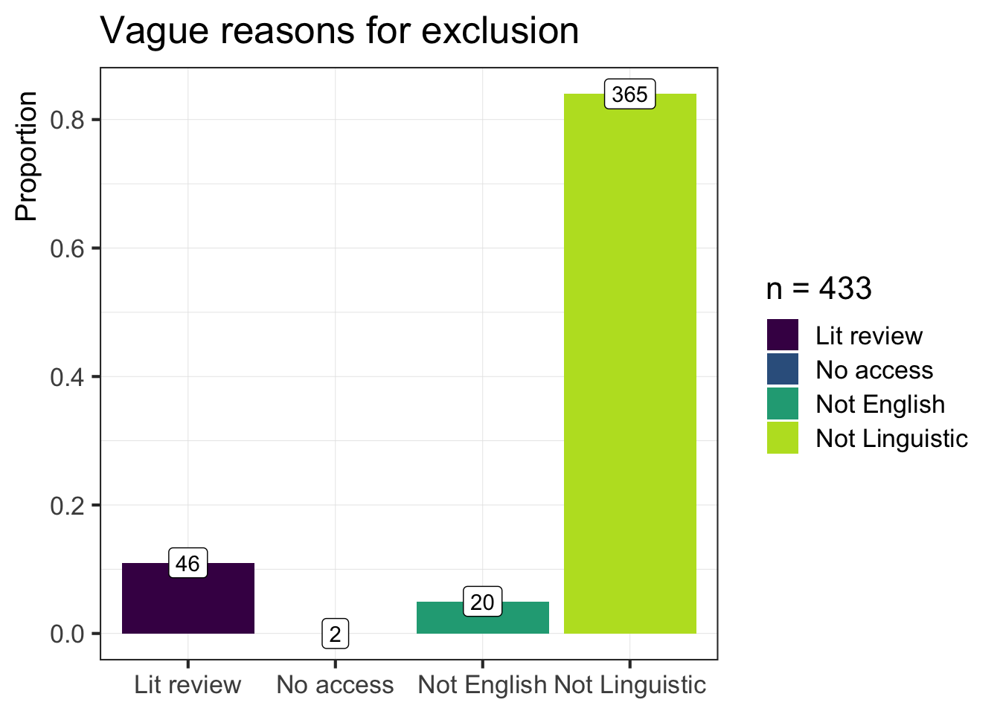

Prescreening descriptive analysis
================

``` r
# Import full dataset
prescreen_df <- read_csv(here("data", "cooder_prescreen_backup_2021_10_21.csv"))
```

# Article breakdown

``` r
no_df <- prescreen_df %>% 
  filter(first_code_include == "No") %>% 
  mutate(
    n_no = nrow(.), 
    vague_reason = case_when(
    str_detect(first_code_reason, "find") ~ "Not found", 
    str_detect(first_code_reason, 
      "english|English|french|French|german|German") ~ "Not English", 
    str_detect(first_code_reason, "access|Access") ~ "No access", 
    str_detect(first_code_reason, "lit review|Lit review|review|Review") ~ "Lit review", 
    TRUE ~ "Not Linguistic")) %>% 
  group_by(vague_reason, n_no) %>% 
  summarize(n = n(), .groups = "drop") %>% 
  mutate(prop = round(n / sum(n), 2)) 

no_df %>% 
  ggplot(., aes(x = vague_reason, y = prop, fill = vague_reason, label = n)) + 
    geom_bar(stat = "identity") + 
    geom_label(fill = "white") + 
    scale_fill_viridis_d(name = glue("n = {no_df$n_no}"), end = 0.9) + 
    labs(y = "Proportion", x = NULL, 
      title = "Vague reasons for exclusion") + 
    theme_simple(base_size = 16)
```


